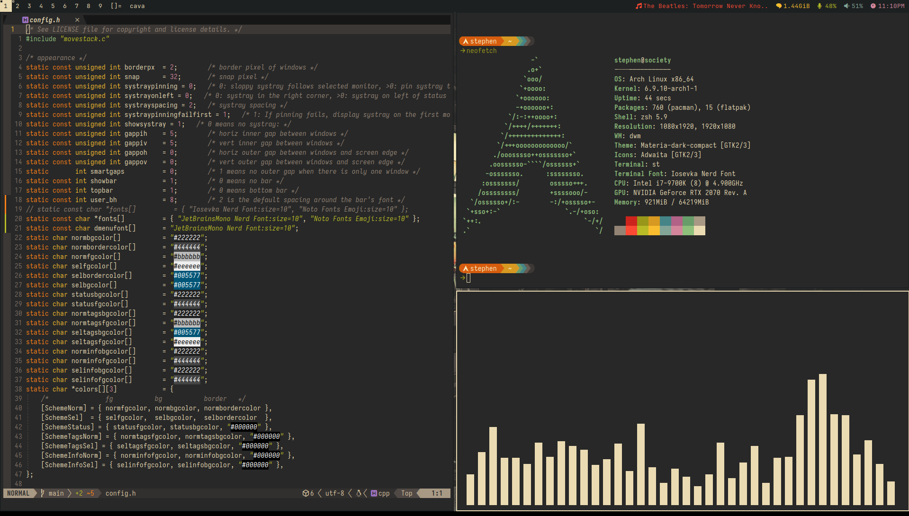
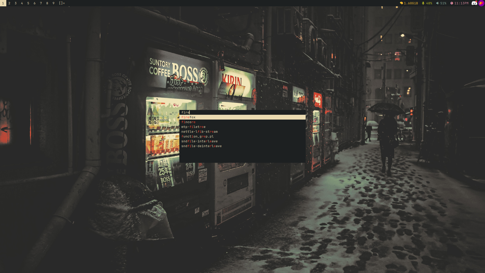

# my gruvbox dots


neovim, neofetch, and cava

dmenu

### Prerequisites
- Everything needed for dwm, dmenu, and st
- **Fonts:** JetBrainsMono Nerd Font (dwm/dmenu), Iosevka Nerd Font (st, dunst)
- feh (for wallpapers)
- dunst (for notifications)
- neovim (for code editing)

### Installation

I might make an installation script eventually. For now, I'm going to assume you know how to install dotfiles.

**NOTE:** please make sure that the contents of .local/bin from this repository are in your `PATH`. The scripts are necessary for dwmblocks (or, if you want, you can use their absolute path in dwmblocks' `config.h` file).

### Usage

The script `.local/bin/dwm-startup.sh` is intended to be the startup script used for this dwm build. It starts all of the necessary programs that I like to have running at startup, including things like dunst, dwmblocks, and setting my wallpaper.

You will probably want to comment out the `fehbg` line until you manually set a wallpaper yourself, as that particular script uses an absolute path (which is almost definitely different from yours, unless your name is also stephen, lol).

You can create a desktop entry for use with a display manager (such as sddm, which I use) by doing the following:

```sudo nvim /usr/share/xsessions/dwm.desktop```

And add the following contents to it:

```desktop
[Desktop Entry]
Encoding=UTF-8
Name=dwm
Comment=dynamic window manager
Exec=/path/to/dwm-startup.sh
Type=XSession
```

Restart your computer and you should be able to select dwm at startup!

You probably know how to do this, but I always forget whenever I reset my machines so this is more for me lmao

### Patch Info

I've made README files for dmenu, dwm, and st, that includes information about the patches they're built with. Check them out at .local/src/<dwm/dmenu/st> if you're curious about replicating my builds with your own versions of dwm/dmenu/st.
